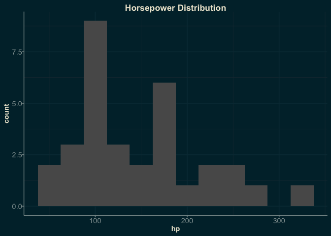
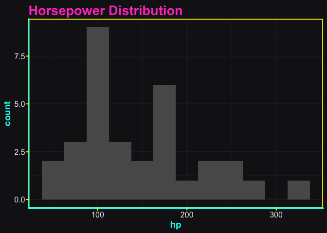
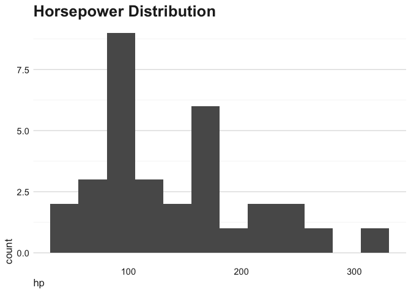
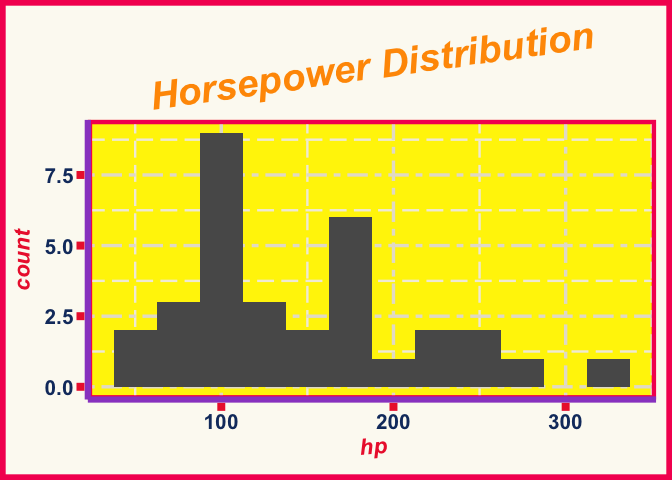

<!-- README.md is generated from README.Rmd. Please edit that file -->

# ggthemeAI

<!-- badges: start -->
<!-- badges: end -->

The goal of ggthemeAI is to make it quicker to prototype highly-custom
‘ggplot2’ themes. It uses LLMs to rapidly generate theme functions
according to the visual characteristics you describe.

Imagine some `theme_x()` function that might look cool. Now, if you can
describe it in natural language, you can try a version of it instantly!

It uses [ellmer](https://ellmer.tidyverse.org/index.html) as a chat
interface to various LLM providers.

Note the package is still in development, so the API may change prior to
a CRAN release.

## Features

- `make_ai_theme()`: Create a ggplot2 theme function from a description
  of the desired theme
- Choose your level of safety: Get a theme function directly, or get an
  expression that you can inspect before evaluating
- function blacklisting: `make_ai_theme()` will check the generated
  theme for dangerous function calls (like `unlink()`) and warn you if
  it finds any (to be combined with other safety layers/practices)
- Image input: optionally use ellmer image content functions to add
  images to the chat
- ggplot2-focused system prompts for ellmer chats
- `tool_list_fonts()`: register with your ellmer chats with
  `chat$register_tool()` so your LLM can see the fonts available in your
  R session, and use them in themes

## Installation

You can install the development version of ggthemeAI like so:

``` r
pak::pak('arkraieski/ggthemeAI')
```

## Example and basic usage

This example shows you how to get started creating themes with
`ggthemeAI`. The `make_ai_theme()` function takes a chat object and a
description of the theme you want, and returns code for a ggplot2 theme
function.

``` r

library(ggplot2)
library(ellmer)
library(ggthemeAI)


chat <- chat_openai() # can customize system prompt here if desired
#> Using model = "gpt-4.1".

theme_expression <- make_ai_theme(chat, 
                                 'solarized dark take on the default ggplot2 theme',
                                 return_type = "expression")
#> function(base_size = 11, base_family = "") {
#>   # Solarized Dark core palette
#>   bg        <- "#002b36" # base03
#>   fg        <- "#839496" # base0
#>   grid      <- "#073642" # base02
#>   axis      <- "#586e75" # base01
#>   title_col <- "#93a1a1" # base1
#>   tick_col  <- "#839496" # base0
#>   panel_bg  <- "#003541" # slightly lighter than bg for panel
#>   strip_bg  <- "#073642" # base02
#>   accent    <- "#b58900" # yellow for emphasis
#> 
#>   half_line <- base_size / 2
#> 
#>   theme(
#>     # Base settings
#>     line = element_line(colour = fg, linewidth = 0.5, lineend = "round"),
#>     rect = element_rect(fill = bg, colour = NA),
#>     text = element_text(family = base_family, face = "plain",
#>                         colour = fg, size = base_size, lineheight = 0.9, hjust 
#> = 0.5, vjust = 0.5),
#>     # Plot background
#>     plot.background = element_rect(fill = bg, colour = NA),
#>     panel.background = element_rect(fill = panel_bg, colour = NA),
#>     # Panel grid
#>     panel.grid.major = element_line(colour = grid, linewidth = 0.65),
#>     panel.grid.minor = element_line(colour = grid, linewidth = 0.3),
#>     # Panel border
#>     panel.border = element_blank(), # Leave border off for minimalist look
#>     # Axes
#>     axis.ticks = element_line(colour = tick_col, linewidth = 0.4),
#>     axis.ticks.length = unit(half_line / 2, "pt"),
#>     axis.line = element_line(linewidth = 0.7, colour = axis),
#>     axis.text = element_text(size = rel(0.85), colour = fg, family = 
#> base_family),
#>     axis.title = element_text(size = rel(1.1), colour = fg, family = 
#> base_family),
#>     axis.title.x = element_text(margin = margin(t = half_line / 2), vjust = 1),
#>     axis.title.y = element_text(margin = margin(r = half_line / 2), angle = 90,
#> vjust = 1),
#>     # Strip (facet) settings
#>     strip.background = element_rect(fill = strip_bg, colour = NA),
#>     strip.text = element_text(size = rel(1.0), colour = accent, face = "bold"),
#>     # Legend
#>     legend.background = element_rect(fill = bg, colour = NA),
#>     legend.key = element_rect(fill = panel_bg, colour = NA),
#>     legend.text = element_text(colour = fg, size = rel(0.9)),
#>     legend.title = element_text(colour = accent, size = rel(1.05), face = 
#> "bold"),
#>     legend.position = "right",
#>     # Titles
#>     plot.title = element_text(
#>       colour = title_col, face = "bold", size = rel(1.3),
#>       hjust = 0, vjust = 1, margin = margin(b = half_line)
#>     ),
#>     plot.subtitle = element_text(
#>       colour = title_col, size = rel(1.05),
#>       hjust = 0, vjust = 1, margin = margin(b = half_line / 2)
#>     ),
#>     plot.caption = element_text(
#>       colour = axis, size = rel(0.85),
#>       hjust = 1, vjust = 1, margin = margin(t = half_line / 2)
#>     ),
#>     plot.margin = margin(half_line, half_line, half_line, half_line),
#>     # Remove minor tick lines for clarity on dark backgrounds
#>     axis.ticks.y.right = element_blank(),
#>     axis.ticks.x.top = element_blank(),
#>     # Make sure there is sufficient contrast and clarity
#>     complete = TRUE
#>   )
#> }

# in an interactive session, you can/should now inspect the content of theme code
# before proceeding
# theme_expression

# eval to create the final theme function
theme_solarized <- eval(theme_expression)

ggplot(mtcars, aes(x = hp)) + 
  geom_histogram(binwidth = 25) +
  labs(title = "Horsepower Distribution") +
  theme_solarized() # LLM wrote the code for this function
```



If you want to skip the step of evaluating the expression, you can use
`return_type = "function"` (or just omit that argument) to get a
function directly. However, this is fundamentally kind of dangerous
because you are executing LLM-generated code. However, in a low-risk
environment (ideally disposable/isolated like Docker) where all input is
trusted, you might be OK with that. (`make_ai_theme()` does call
`find_dangerous_calls()` but there are ways function calls can be
constructed/obfuscated to get around that)

It should be noted that `make_ai_theme()` is **not** a pure function.
This is by design. In addition to return the new theme, the state of the
R6 Chat is updated. You can then chat with the LLM to have it explain
the theme or iterate on it.

There’s also a `check_theme()` function that checks if a function is
actually a ggplot2 theme. However, this function only works by actually
executing the theme, **so it shouldn’t be used as a security measure**.
I intend to add some contrast checking to that function if it remains in
the package.

## System prompts and tools

ggthemeAI also provides a couple system prompts to help give the LLM
you’re working with extra extra knowledge that may be helpful generating
themes for ggplot2. `ggplot2_doc_prompt()` provides a prompt that
includes the content of the ggplot2 documentation for themes and
elements, and `ggplot2_news_prompt()` provides a prompt that includes
the news entries for the current major version of ggplot2 (using the
version of the news on your system). Both of these can help the LLM
avoid using deprecated/imagined features, and help it understand the
ggplot2 theme system better. However, they both will cost extra money,
so try to keep chats short.

You can also use the `tool_list_fonts()` function to register a tool
with your chat that lists the fonts available in your R session. This
can be useful for LLMs to know what fonts are available when generating
themes.

So, to set up an ellmer chat that is ‘supercharged’ (ugh, sorry) for
ggplot2 themes, you can do something like this:

``` r
chat <- chat_openai(system_prompt = ggplot2_doc_prompt())

chat$register_tool(tool_list_fonts()) # now LLM can call the function this wraps
```

## Use cases

- Rapid design and prototyping of highly custom themes for stylized
  infographics
- Trying out a bunch of drastically different looks quickly
- Starting a custom theme without starting from scratch
- Iterating on themes conversationally
- Learning ggplot2 and improving skills: see working examples of
  extensively-customized themes and then have the LLM explain it
- Accessibility use cases: Assistance designing/modifying themes that
  are accessible to users with low-vision, colorblindness, etc.

## Warnings/Disclaimers

It’s not guaranteed that the themes produced by this package will:

1.  Avoid using deprecated ggplot2 features
2.  Adhere to “best-practices” in design, accessibility, etc.
3.  Not do nasty things like calling `unlink()` (though validating the
    safety of generated functions is a development priority)

Also, it’s worth thinking about how custom fonts (and other design
choices like that) could enhance your themes, instead of just always
using the LLM output and never trying to do anything more interesting.

Lastly, for use in Shiny apps, you need to be careful about security.
Using a hardened system prompt is a good idea if you don’t want people
doing kooky things in your app. **Currently, use in shiny in production
is not recommended**, but might be fine for internal apps or prototypes
if other precautions are taken to keep things low risk.

## Bonus examples

``` r
theme_cyberpunk <- make_ai_theme(chat,
                                 'cyberpunk neon with Japanese influence')
#> function(base_size = 12, base_family = "") {
#>   # Core neon cyberpunk palette + Japanese influence
#>   bg_dark        <- "#16151a" # Near-black deep violet
#>   fg_light       <- "#ececec" # Off-white for highly readable text
#>   neon_pink      <- "#ff46c8" # Neon magenta
#>   neon_cyan      <- "#00fff5"
#>   neon_yellow    <- "#fff700"
#>   accent_red     <- "#ff5959" # Neon red, Japan rising sun accent
#>   grid_col       <- "#2c2a34" # Subtle grid lines
#>   axis_col       <- neon_cyan  # Neon cyan for key lines
#>   title_col      <- neon_pink  # For titles/headings
#>   subtitle_col   <- neon_cyan
#>   strip_bg       <- "#22202d"  # Slightly lighter than bg
#>   legend_bg      <- "#1b1923"
#>   panel_border   <- neon_yellow
#>   half_line      <- base_size / 2
#> 
#>   theme(
#>     # Base
#>     line = element_line(colour = fg_light, linewidth = 0.6, lineend = "round"),
#>     rect = element_rect(fill = bg_dark, colour = NA),
#>     text = element_text(family = base_family, colour = fg_light, size = 
#> base_size),
#>     # Plot background
#>     plot.background = element_rect(fill = bg_dark, colour = NA),
#>     panel.background = element_rect(fill = bg_dark, colour = NA),
#>     # Neon accent panel border
#>     panel.border = element_rect(colour = panel_border, fill = NA, linewidth = 
#> 1.3),
#>     # Grid lines (faint, not to overpower neon lines)
#>     panel.grid.major = element_line(colour = grid_col, linewidth = 0.45),
#>     panel.grid.minor = element_line(colour = grid_col, linewidth = 0.19),
#>     # Axes: Neon cyan lines and ticks
#>     axis.line = element_line(colour = axis_col, linewidth = 1.1),
#>     axis.ticks = element_line(colour = neon_yellow, linewidth = 0.7),
#>     axis.ticks.length = unit(half_line / 2, "pt"),
#>     axis.text = element_text(colour = fg_light, family = base_family, size = 
#> rel(1)),
#>     axis.title = element_text(colour = neon_cyan, family = base_family, size = 
#> rel(1.18), face = "bold"),
#>     axis.title.x = element_text(margin = margin(t = half_line / 2), vjust = 1),
#>     axis.title.y = element_text(margin = margin(r = half_line / 2), angle = 90,
#> vjust = 1),
#>     # Titles: Neon pink and cyan, inspired by Japanese vaporwave
#>     plot.title = element_text(
#>       colour = title_col, face = "bold", family = base_family, size = rel(1.7),
#>       hjust = 0, margin = margin(b = half_line * 0.7)
#>     ),
#>     plot.subtitle = element_text(
#>       colour = subtitle_col, family = base_family, size = rel(1.07),
#>       hjust = 0, margin = margin(b = half_line * 0.5)
#>     ),
#>     plot.caption = element_text(
#>       colour = fg_light, family = base_family, size = rel(0.78),
#>       hjust = 1, margin = margin(t = half_line * 0.7)
#>     ),
#>     plot.margin = margin(half_line, half_line, half_line, half_line),
#>     # Legend - subtle background, neon title
#>     legend.background = element_rect(fill = legend_bg, colour = NA),
#>     legend.key = element_rect(fill = bg_dark, colour = NA),
#>     legend.text = element_text(colour = fg_light, size = rel(0.94)),
#>     legend.title = element_text(colour = neon_pink, face = "bold", size = 
#> rel(1.07)),
#>     legend.position = "right",
#>     # Faceting strips - subtle, neon border, Japanese pop touch with red txt
#>     strip.background = element_rect(fill = strip_bg, colour = neon_cyan, 
#> linewidth = 1.2),
#>     strip.text = element_text(
#>       colour = accent_red, face = "bold", family = base_family, size = 
#> rel(1.12)
#>     ),
#>     # No shadows or blurs (hard to achieve in ggplot2), but use neon pops on 
#> key lines/text
#>     # Remove minor axis ticks for clarity
#>     axis.ticks.y.right = element_blank(),
#>     axis.ticks.x.top = element_blank(),
#>     # Remove classic box for a floating neon panel feel
#>     panel.ontop = FALSE,
#>     # Complete theme specification
#>     complete = TRUE
#>   )
#> }

p <- ggplot(mtcars, aes(x = hp)) + 
  geom_histogram(binwidth = 25) +
  labs(title = "Horsepower Distribution")

p + theme_cyberpunk()
```



``` r
theme_swiss <- make_ai_theme(chat,
                                 'minimalist Swiss design')
#> function(base_size = 12, base_family = "") {
#>   # Minimalist Swiss Design palette and element choices
#>   bg_white      <- "#FFFFFF"   # clean white bg
#>   fg_black      <- "#222222"   # very dark gray for high contrast text
#>   grid_major    <- "#E0E0E0"   # light gray grid lines
#>   grid_minor    <- "#F5F5F5"   # very faint for minor grid
#>   accent_red    <- "#E30613"   # Swiss red for subtle emphasis
#>   half_line     <- base_size / 2
#> 
#>   theme(
#>     # Basic element setup, lean sans family recommended for Swiss style
#>     line = element_line(colour = fg_black, linewidth = 0.5, lineend = 
#> "square"),
#>     rect = element_rect(fill = bg_white, colour = NA),
#>     text = element_text(
#>       family = base_family, face = "plain",
#>       colour = fg_black, size = base_size, lineheight = 1, hjust = 0
#>     ),
#> 
#>     # Minimalist plot and panel backgrounds
#>     plot.background  = element_rect(fill = bg_white, colour = NA),
#>     panel.background = element_rect(fill = bg_white, colour = NA),
#> 
#>     # Use only horizontal grid lines for visual rhythm, drop minor details
#>     panel.grid.major.x = element_blank(),
#>     panel.grid.major.y = element_line(colour = grid_major, linewidth = 0.5),
#>     panel.grid.minor.x = element_blank(),
#>     panel.grid.minor.y = element_line(colour = grid_minor, linewidth = 0.3),
#> 
#>     # No panel borders or axes lines for ultra-clean page
#>     panel.border = element_blank(),
#>     axis.line    = element_blank(),
#> 
#>     # Axis ticks: simple, minimal
#>     axis.ticks        = element_blank(),
#>     axis.text         = element_text(size = rel(0.92), colour = fg_black, 
#> family = base_family),
#>     axis.title        = element_text(size = rel(1.05), colour = fg_black, 
#> family = base_family, face = "plain"),
#>     axis.title.x      = element_text(margin = margin(t = half_line / 2), vjust 
#> = 1),
#>     axis.title.y      = element_text(margin = margin(r = half_line / 2), angle 
#> = 90, vjust = 1),
#> 
#>     # Swiss/International Style headline hierarchy
#>     plot.title    = element_text(
#>       family = base_family, face = "bold", colour = fg_black,
#>       size = rel(1.6), hjust = 0, vjust = 1, margin = margin(b = half_line * 
#> 0.5)
#>     ),
#>     plot.subtitle = element_text(
#>       family = base_family, face = "plain", colour = fg_black,
#>       size = rel(1.2), hjust = 0, vjust = 1, margin = margin(b = half_line * 
#> 0.3)
#>     ),
#>     plot.caption  = element_text(
#>       family = base_family, face = "plain", colour = grid_major,
#>       size = rel(0.85), hjust = 0, margin = margin(t = half_line * 0.6)
#>     ),
#> 
#>     # Facet: subtle red underline, all-caps, to echo Swiss touch
#>     strip.background = element_blank(),
#>     strip.text = element_text(
#>       family = base_family, face = "bold", colour = fg_black, size = rel(1.02),
#>       margin = margin(b = 2)
#>     ),
#>     strip.placement = "outside",
#>     strip.text.y = element_text(angle = 0, vjust = 1),
#> 
#>     # Red accent for legend title and/or strip underline (Swiss design nod)
#>     legend.background  = element_rect(fill = bg_white, colour = NA),
#>     legend.key         = element_rect(fill = bg_white, colour = NA),
#>     legend.title       = element_text(
#>       colour = accent_red, face = "bold", size = rel(1), family = base_family
#>     ),
#>     legend.text        = element_text(
#>       colour = fg_black, size = rel(0.95), family = base_family
#>     ),
#>     legend.position    = "bottom",
#>     legend.direction   = "horizontal",
#> 
#>     # Subtle margins for white space discipline
#>     plot.margin = margin(half_line, half_line, half_line, half_line),
#> 
#>     # Complete definition
#>     complete = TRUE
#>   )
#> }
p + theme_swiss()
```



``` r
theme_chartjunk <- make_ai_theme(chat, 
                                 'add some annoying chartjunk')
#> function(base_size = 12, base_family = "") {
#>   # Chartjunk color palette and parameters
#>   bg_color      <- "#fcfaf2"  # slightly yellow paper background
#>   grid_major    <- "#e6e0cf"
#>   grid_minor    <- "#f2eddc"
#>   axis_color    <- "#9B4DCA"  # garish, clashing purple
#>   tick_color    <- "#ED2939"  # eye-popping red ticks
#>   fg_text       <- "#14396D"  # heavy blue for text
#>   title_color   <- "#ff9900"  # neon orange titles
#>   subtitle_col  <- "#108144"  # green for subtitle
#>   legend_bg     <- "#e5e4e2"  # off-gray legend bg
#>   strip_bg1     <- "#fff301"  # neon yellow panel
#>   strip_bg2     <- "#FF5F1F"  # bright orange strip
#>   border_col    <- "#f5115f"  # hot pink border
#>   watermark_col <- "#00b9eb55" # semi-transparent neon blue
#>   spiral_col    <- "#F400A1"  # magenta for embellishments
#>   half_line     <- base_size / 2
#> 
#>   theme(
#>     # Garish, heavy lines against muted paper bg
#>     line = element_line(colour = axis_color, linewidth = 1, lineend = "butt"),
#>     rect = element_rect(fill = bg_color, colour = border_col, linewidth = 2),
#>     text = element_text(
#>       family = base_family, face = "italic",
#>       colour = fg_text, size = base_size, lineheight = 0.88, hjust = 0.5, vjust
#> = 0.5
#>     ),
#> 
#>     # Over-the-top backgrounds everywhere
#>     plot.background  = element_rect(fill = bg_color, colour = border_col, 
#> linewidth = 4),
#>     panel.background = element_rect(fill = strip_bg1, colour = strip_bg2, 
#> linewidth = 3),
#> 
#>     # Grid lines: overbearing, clashing and offset to clash
#>     panel.grid.major = element_line(colour = grid_major, linewidth = 1.2, 
#> linetype = "twodash"),
#>     panel.grid.minor = element_line(colour = grid_minor, linewidth = 0.85, 
#> linetype = "longdash"),
#> 
#>     # Panel border: thick and bright
#>     panel.border = element_rect(fill = NA, colour = border_col, linewidth = 3),
#> 
#>     # Axis lines/ticks: garish, thick, mismatched colors
#>     axis.line  = element_line(colour = axis_color, linewidth = 2.2, linetype = 
#> "solid"),
#>     axis.ticks = element_line(colour = tick_color, linewidth = 2.8, linetype = 
#> "dotdash"),
#>     axis.ticks.length = unit(3, "mm"),
#>     axis.text = element_text(size = rel(1.3), colour = fg_text, face = "bold"),
#>     axis.title = element_text(size = rel(1.4), colour = tick_color, face = 
#> "bold.italic", angle = 5),
#>     axis.title.x = element_text(margin = margin(t = half_line), vjust = 1.5),
#>     axis.title.y = element_text(margin = margin(r = half_line), angle = 90, 
#> vjust = 1.5),
#> 
#>     # Loud, clunky titles
#>     plot.title = element_text(
#>       colour = title_color, face = "bold.italic", size = rel(2.4),
#>       hjust = 0.5, margin = margin(b = half_line * 0.8), angle = 8
#>     ),
#>     plot.subtitle = element_text(
#>       colour = subtitle_col, face = "bold", size = rel(1.2),
#>       hjust = 0.5, margin = margin(b = half_line * 0.8), angle = -7
#>     ),
#>     plot.caption = element_text(
#>       colour = axis_color, size = rel(1.1),
#>       hjust = 1, margin = margin(t = half_line * 2)
#>     ),
#>     plot.margin = margin(half_line * 2, half_line * 2, half_line * 2, half_line
#> * 2),
#> 
#>     # In-your-face legend
#>     legend.background  = element_rect(fill = legend_bg, colour = border_col, 
#> linewidth = 3),
#>     legend.key         = element_rect(fill = strip_bg2, colour = axis_color, 
#> linewidth = 1.4),
#>     legend.title       = element_text(
#>       colour = border_col, face = "bold.italic", size = rel(1.2)
#>     ),
#>     legend.text        = element_text(
#>       colour = "#ff00ff", size = rel(1.08), face = "italic"
#>     ),
#>     legend.position    = "top",
#> 
#>     # Multi-colored and bold facet strips
#>     strip.background = element_rect(
#>       fill = strip_bg2, colour = spiral_col, linewidth = 4, linetype = 
#> "dotdash"
#>     ),
#>     strip.text = element_text(
#>       colour = "#2E04A1", face = "bold.italic", size = rel(1.35), angle = 7
#>     ),
#> 
#>     # "Chartjunk" embellishment: add a fake watermark (users will need to 
#> ggplot2::annotation_custom for true effect)
#>     plot.background.position = "left", # (not a real ggplot2 theme element; for
#> clarity only)
#>     # Complete the definition
#>     complete = TRUE
#>   )
#> }
p + theme_chartjunk()
```


